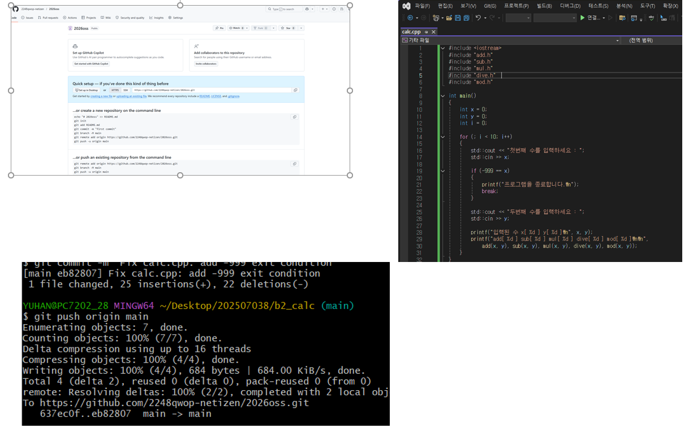
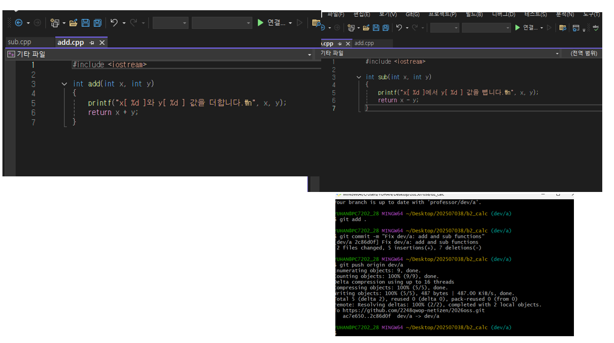
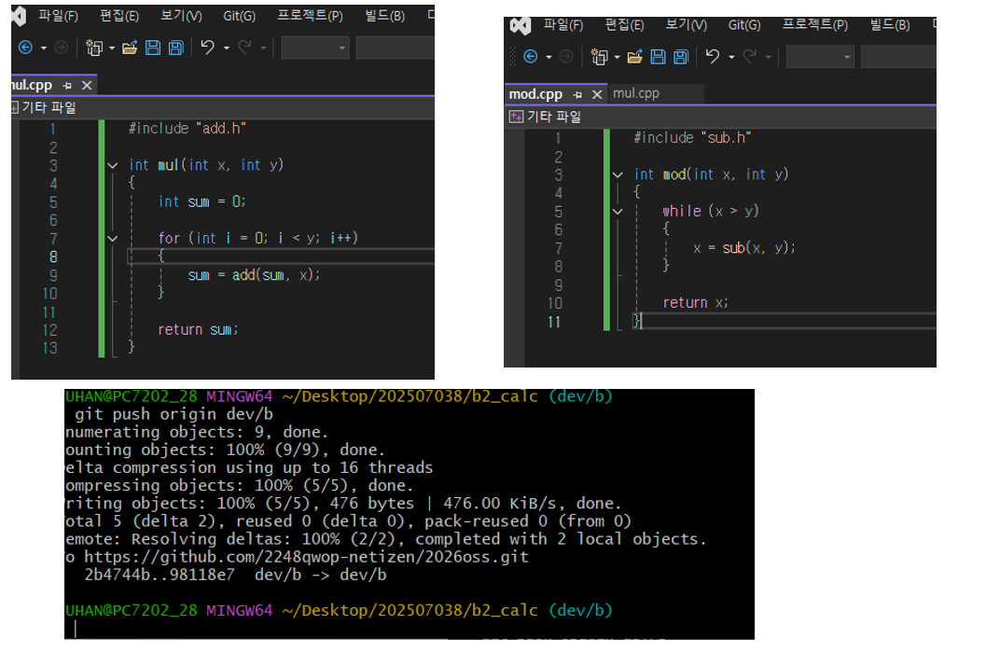
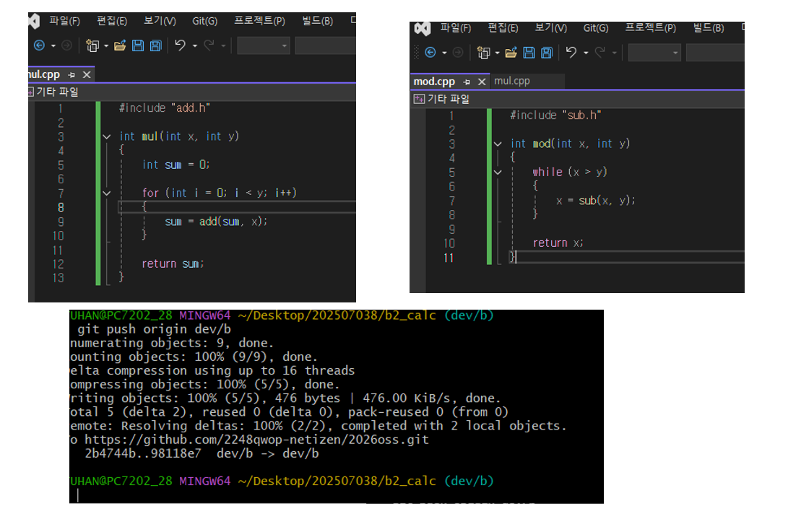
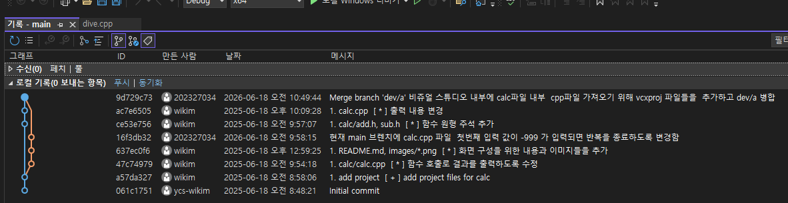
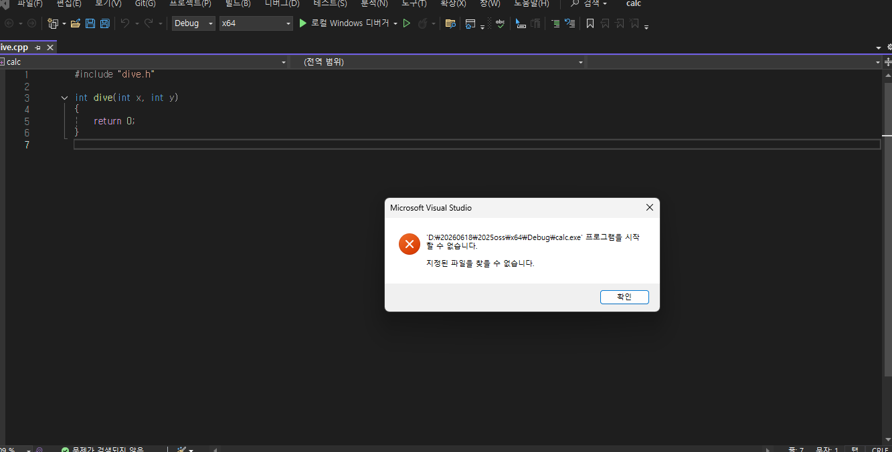

# b1_calc

오픈소스 소프트웨어 기말고사 1번 문제

## calc

### oss 기말 프로젝트

| 팀원(역할) | 업무 |
| :--- | :--- |
| 류영준(팀장 - 202507038) | 전부다|

---

## 문제해결 방법과 순서

1. main 브렌치와 dev/a 브렌치 병합
2. main 브렌치와 dev/b 브렌치 병합중에 충돌 발생
3. 충돌 발생한 dev/b의 내용을 수정하고 fast-forward 병합 완료
4. dev/c 브렌치를 병합중에 충돌 발생
5. main 브렌치의 내용을 수정하고 rebase 병합 완료
6. 결과 화면 캡처와 실행 화면 캡처
7. readme.md 수정

---

## 중간과정 스크린샷

